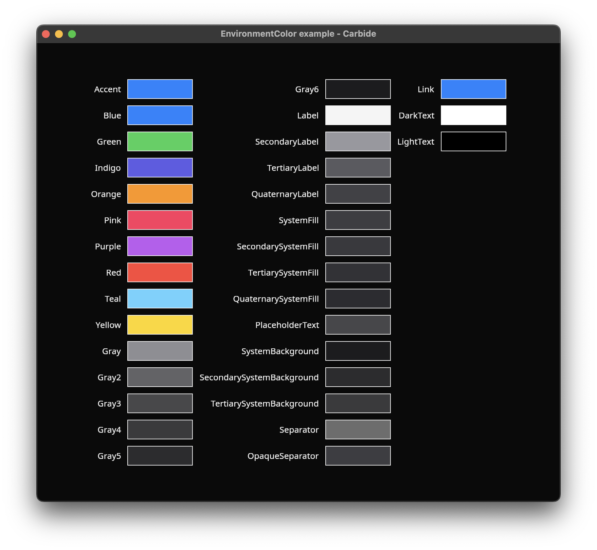

+++
title = "Colors"
+++

# Colors
When rendering in Carbide, each shape can have a `Color`. In Carbide, this color is specified using an enum (in `color.rs`), and can be constructed on multiple different ways. 

The most common way to create a new `Color` is by using its `Color::new_rgb()` or `Color::new_rgba()` methods. These will construct a RGBA color based on the different color components given as input.

Carbide has a few predefined colors. These can be used as simple debugging colors. The predefined colors are not recommended to be used, since they were migrated over when we forked Conrod in 2021, and has not been updated since.

A color can also be used in a [Gradient](@/docs/general/gradient/index.md), allowing you to create more complex visual effects.

A few other interesting ways of constructing a color exist. You can generate a random color using `Color::random()` method, which creates a new random color each time the method is called. You can also generate a new color based on the current time using the `Color::time()` method. This rotates through different hues of an HSL color based on the current time.

> It is recommended, when rendering, to use [EnvironmentColor](TODO), and not use the Color type directly. This enables Carbide to apply [themeing](TODO) and other modifications to the color based on user preferences, such as lightmode, darkmode, and custom themes. It also allows custom overrides higher in the [widget tree](TODO), for example setting the [EnvironmentColor](TODO) red, to another shade, or an entirely different color.

## The color example
The colors example showcases the different [EnvironmentColor](TODO)'s when rendered using the current [Theme](TODO).

### Run the example
The example can be run with the following command: `cargo run --package carbide_wgpu --example colors` when located in the working directory `carbide`. 

For better performance, remember to run the example with `--release`.

## Color reprensentation
In Carbide, colors can be represented in two diffrent ways. Either the color is specified using the RGBA components or the HSLA components.

Carbide converts between the different colors based on the methods you call.

## EnvironmentColor
An `EnvironmentColor` provides a mechanish of using semantic and configurable colors instead of choosing a color with specific RGB values. The most common color variants are the [Accent](@/examples/drawing/accent/index.md) and the [Label](TODO). 

The accent environment color is the default color for the different [shapes](@/examples/drawing/shapes/index.md), such as Rectangle, Circle, Capsule and more.

The label environment color is the default color for rendering [Text](TODO) and [icon images](TODO).

`EnvironmentColor`'s are configurable in the [Environment](TODO), and can be overridden by inserting them into the widget tree. The `EnvironmentColor` is inherited by the [widget children](TODO), and the closest override to the thing being rendered takes precedence.