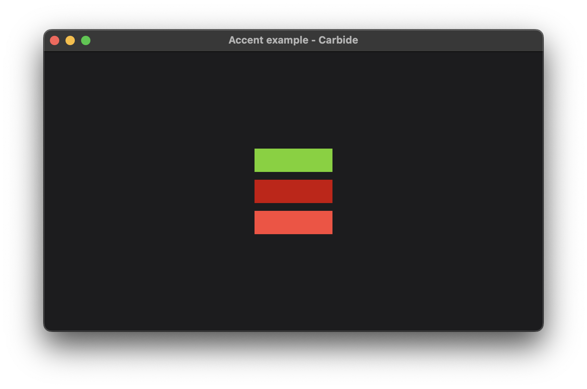

+++
title = "Accent"
date = 2019-11-28
+++

# Accent 



The accent example shows how to change the accent color of the [environment](TODO), when rendering. The environment is inherited by a [widget's children](TODO), and is following the [normal scoping rules](TODO).

## Explanation
When rendering, unless otherwise specified, shapes uses the accent color from the environment to fill the shape. 

The accent color of the environment can be overridden using the `.accent_color()` [modifier](TODO). This modifier can be applied to any widget. The modifier takes anything that can be turned into a [State](TODO) of [Color](@/docs/general/colors/index.md). This is for example a static [Color](@/docs/general/colors/index.md), and [EnvironmentColor](@/docs/general/colors/index.md#environmentcolor) and others.

Below we see the source code of the example:
```rust
fn main() {
    let mut application = Application::new();

    application.set_scene(
        Window::new(
            "Accent example - Carbide",
            Dimension::new(600.0, 600.0),
            VStack::new((
                Rectangle::new()
                    .frame(100.0, 30.0),
                Rectangle::new()
                    .frame(100.0, 30.0)
                    .accent_color(RED),
                Rectangle::new()
                    .frame(100.0, 30.0)
                    .accent_color(EnvironmentColor::Red)
            )).accent_color(GREEN)
        )
    );

    application.launch()
}
```

We start by creating an [Application](TODO), and setting the [Scene](TODO) of that application. The scene consist of a single [Window](TODO). 

The content of the window is a [VStack](TODO), which has three rectangles.

The `.accent_color()` modifier is used in three different places. It is applied to the [VStack](TODO), which affects all its children. This is why the first rectangle is green.

The second modifier is applied to the second rectangle. This overrides the accent color and sets it to the color red, which we see in the result.

The third modifier is applied to the third rectangle, and is using the [EnvironmentColor](@/docs/general/colors/index.md#environmentcolor) red. Since this is an environment specific color, it is not pre determined, but can change based on the [Theme](TODO) and overridden.

## Run the example
The example can be run with the following command: `cargo run --package carbide_wgpu --example accent` when located in the working directory `carbide`. 

For better performance, remember to run the example with `--release`.