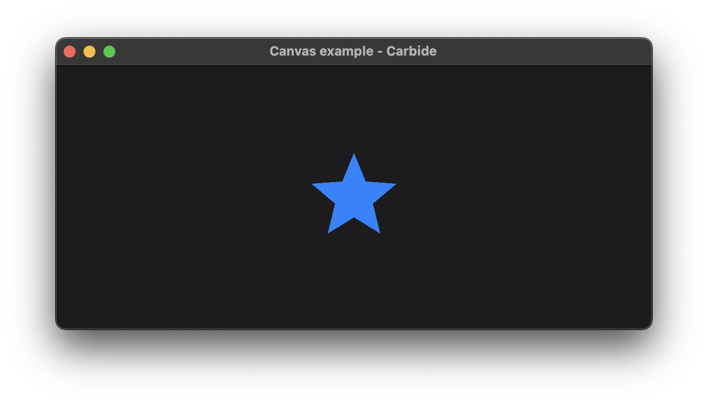

+++
title = "Canvas"
date = 2019-11-28
+++

# Canvas 

The canvas example showcases how to draw a simple shape using the Canvas widget. Rendering using a canvas is declarative, and is based on the HTML canvas. 

For more information on how the Canvas widget works, see **INSERT DOC LINK**.

## Explanation
The example consist of a single centered Canvas element. The Canvas element has a canvas context, and which uses in a call to a function called `draw_star`. This function takes inputs defining what star to draw, and calles the different canvas context methods in order to draw the star.

The rendering is using the [accent color](@/examples/drawing/accent/index.md), and is filled.

## Run the example
The example can be run with the following command: `cargo run --package carbide_wgpu --example canvas` when located in the working directory `carbide`. 

For better performance, remember to run the example with `--release`.