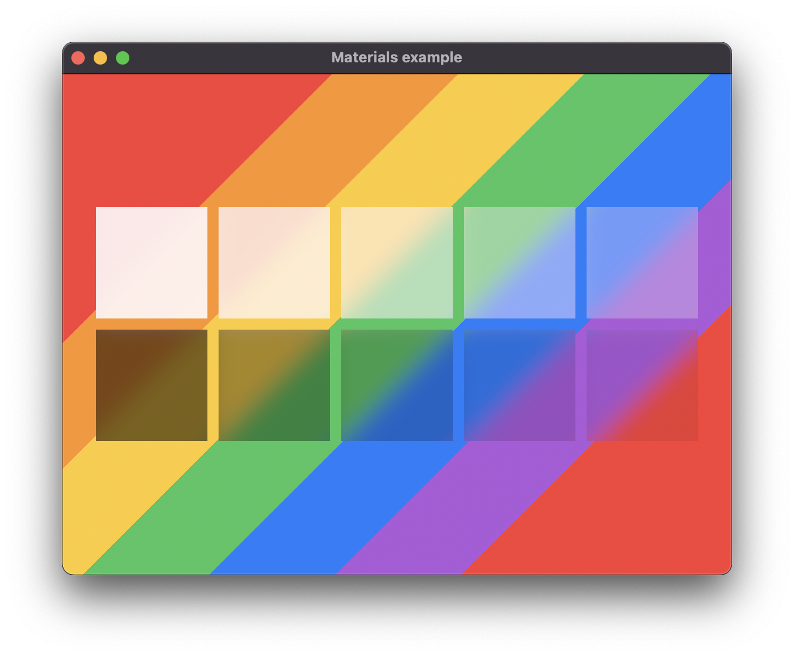

+++
title = "Materials"
date = 2019-11-28
+++

# Materials 

The materials example showcases the different built-in materials in Carbide. These are used to render shapes in a special way with different depths and colors.

A material is different than a Color, because a material includes other effects. The currently available materials uses the Blur effect.

## Explanation
The example consist of two rows of rectangles, where the first row uses the light theme material, and the second row the dark theme. Each row consist of 5 different matarials, each of a different strength, with the strength decreasing from left to right.

The background consist of multiple different colored rectangles, that are rotated to better show the effect of the materials.

## Run the example
The example can be run with the following command: `cargo run --package carbide_wgpu --example materials` when located in the working directory `carbide`. 

For better performance, remember to run the example with `--release`.