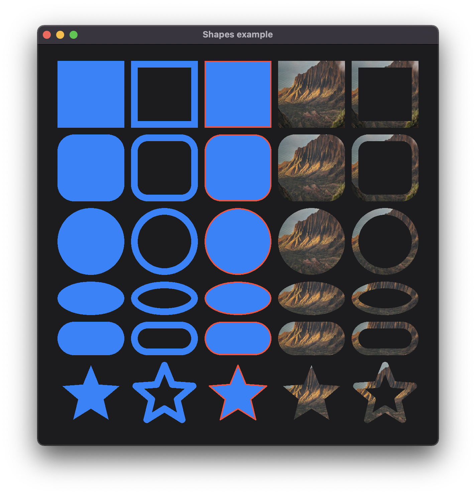

+++
title = "Shapes"
+++

# Shapes

The shapes example showcases the different built-in shapes in Carbide. These are used as content for the different widgets to render them. They are treated as atoms, and can be combined using different layouts, into more complex shapes.

## Explanation
The example consist of 5 columns, each rendering the same shape, but in different ways. The different renderings are:
* Fill
* Stroke
* Fill and stroke
* Clipped image fill
* Clipped image stroke

Rendering of the filled shapes are using the current [accent color](@/examples/drawing/accent/index.md) from the environment.

Each row consist of a shape. The shapes are:
* Rectangle
* RoundedRectangle
* Circle
* Ellipse
* Capsule
* [Canvas](@/examples/drawing/canvas/index.md)

The last row is a Canvas element, configured to draw a star.

## Run the example
The example can be run with the following command: `cargo run --package carbide_wgpu --example shapes` when located in the working directory `carbide`. 

For better performance, remember to run the example with `--release`.